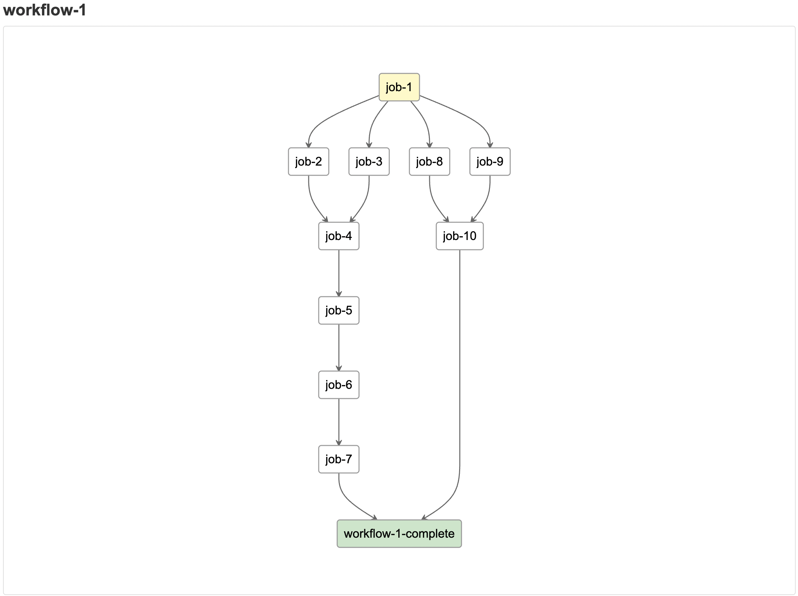
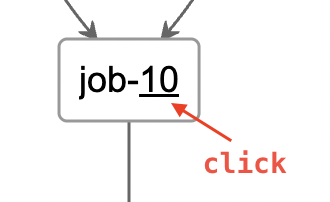
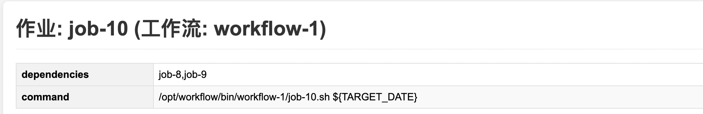

## 概述

此项目包含一个基于 Web 的 Azkaban workflow模拟工具，用于在不部署 Azkaban([LINK](https://azkaban.github.io/)) 的情况下，快速查看一个Azkaban workflow压缩包(.zip)的流程图。
注：Azkaban 是一个工作流调度系统。

## 主要文件说明

- **index.html**: 主入口页面，提供整体交互界面。
- **job.html**: 用于显示单个job的详细信息，包含job参数。
- **d3.min.js 和 dagre-d3.min.js**: JavaScript 库，用于图形渲染和节点布局，帮助可视化作业依赖图。
- **jszip.min.js**: 用于解析 ZIP 文件。

## 如何使用

- 用浏览器打开 index.html 文件。
- 拖动一个 zip 文件到页面的文件选择框中，或者点击它选择一个 zip 文件，然后就可以查看网页绘制出的workflow图。

- 在绘制出的workflow图中，点击一个job节点名称中的**最后一个单词**上的超链接，可以查看该job的详细信息。

## 依赖与要求

- 环境：无特殊要求。

## 注意事项

- 目前尚不支持嵌套的 Azkaban workflow。

---

## Overview

This project provides a web-based Azkaban workflow simulation tool that allows you to quickly view the flowchart of an Azkaban workflow package (.zip) without deploying Azkaban ([LINK](https://azkaban.github.io/)).
Note: Azkaban is a workflow scheduling system.

## Main Files Description

- **index.html**: The main entry page, providing the overall interactive interface.
- **job.html**: Used to display detailed information for a single job, including job parameters.
- **d3.min.js and dagre-d3.min.js**: JavaScript libraries for graph rendering and node layout, helping visualize job dependency graphs.
- **jszip.min.js**: Used to parse ZIP files.

## How to Use

- Open the index.html file in your browser.
- Drag a zip file to the file selection box on the page, or click it to select a zip file, and then you can view the workflow diagram drawn by the webpage.

- In the drawn workflow diagram, click the hyperlink on the **last word** in a job node name to view the detailed information of that job.

## Dependencies & Requirements

- Environment: No special requirements.

## Notes

- Nested Azkaban workflows are not supported yet.
