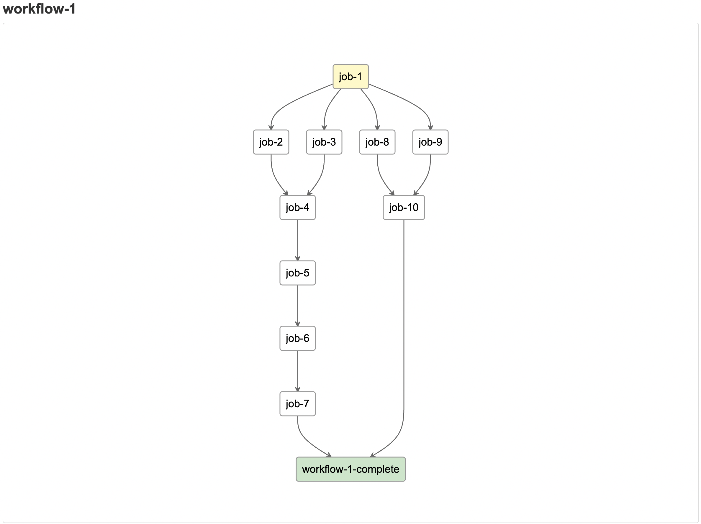
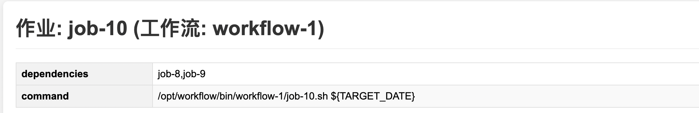

## 概述

此项目包含一个基于 Web 的 Azkaban workflow 模拟工具，用于在不部署 Azkaban([LINK](https://azkaban.github.io/)) 的情况下，快速查看一个 Azkaban workflow 压缩包(.zip)的流程图。

同时，本项目也提供了 VS Code 扩展版本，可以在 VS Code 及其兼容的 IDE 中安装使用。

注：Azkaban 是一个开源的工作流调度系统。

## 主要文件说明

- **web/index.html**: 主入口页面，提供整体交互界面。
- **web/job.html**: 用于显示单个job的详细信息，包含job参数。
- **web/d3.min.js 和 web/dagre-d3.min.js**: JavaScript 库，用于图形渲染和节点布局，帮助可视化作业依赖图。
- **web/jszip.min.js**: 用于解析 ZIP 文件。
- **extension.js**: VS Code 扩展入口，用于在编辑器内打开 Webview。
- **icon.png**: VS Code 扩展图标。
- **package.json**: VS Code 扩展清单文件。

## 如何使用

### 作为网页应用

- 用浏览器打开 `web/index.html` 文件。
- 拖动一个 zip 文件到页面的文件选择框中，或者点击它选择一个 zip 文件，然后就可以查看网页绘制出的 workflow 图。

- 在绘制出的 workflow 图中，点击一个 job 节点名称中的**最后一个单词**上的超链接，可以查看该 job 的详细信息。

### 作为 VS Code 扩展

1. 在扩展市场中搜索 **Azkaban Simulator** 并安装。
2. 按 `Ctrl+Shift+P`（或 `Cmd+Shift+P`）打开命令面板。
3. 输入并运行 `Open Azkaban Simulator` 命令。
4. 在弹出的文件选择框中选择一个 Azkaban workflow 的 `.zip` 文件。
5. 在绘制出的 workflow 图中点击 job 节点名称中的超链接，可在新的 Webview 面板中查看该 job 的详细信息。

## 依赖与要求

- 环境：无特殊要求。

## 注意事项

- 目前尚不支持嵌套的 Azkaban workflow。

---

作者：Darran Zhang @ [codelast.com](https://codelast.com)

---

## Overview

This project provides a web-based Azkaban workflow simulation tool that allows you to quickly view the flowchart of an Azkaban workflow package (.zip) without deploying Azkaban ([LINK](https://azkaban.github.io/)).

It is also packaged as a VS Code extension, so you can install and use it in VS Code and compatible IDEs (such as Cursor, Qoder, etc.).

Note: Azkaban is a workflow scheduling system.

## Main Files Description

- **web/index.html**: The main entry page, providing the overall interactive interface.
- **web/job.html**: Used to display detailed information for a single job, including job parameters.
- **web/d3.min.js and web/dagre-d3.min.js**: JavaScript libraries for graph rendering and node layout, helping visualize job dependency graphs.
- **web/jszip.min.js**: Used to parse ZIP files.
- **extension.js**: VS Code extension entry point that opens the simulator inside an editor Webview.
- **icon.png**: VS Code extension icon.
- **package.json**: VS Code extension manifest file.

## How to Use

### As a Web Application

- Open the `web/index.html` file in your browser.
- Drag a zip file to the file selection box on the page, or click it to select a zip file, and then you can view the workflow diagram drawn by the webpage.

- In the drawn workflow diagram, click the hyperlink on the **last word** in a job node name to view the detailed information of that job.

### As a VS Code Extension

1. Search for **Azkaban Simulator** in the Extensions marketplace of VS Code or a compatible IDE and install it.
2. Press `Ctrl+Shift+P` (or `Cmd+Shift+P`) to open the Command Palette.
3. Run the `Open Azkaban Simulator` command.
4. Select an Azkaban workflow `.zip` file in the file dialog.
5. In the drawn workflow diagram, click the hyperlink in a job node name to view its details in a new Webview panel.

## Dependencies & Requirements

- Environment: No special requirements.

## Notes

- Nested Azkaban workflows are not supported yet.

---

Made by Darran Zhang from [codelast.com](https://codelast.com)
